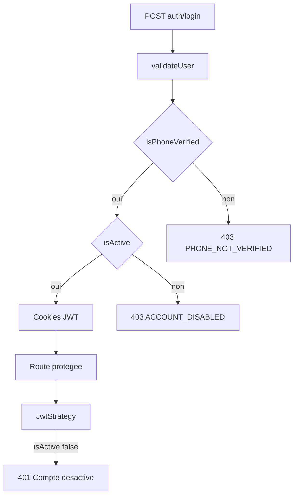

# Blocage des comptes inactifs (auth)

Aujourd’hui un compte désactivé (`User.isActive = false`) **peut encore se logger** : `validateUser` ne lit pas ce flag. Le blocage n’arrive que plus tard, sur les routes protégées, via [`jwt.strategy.ts`](src/auth/strategies/jwt.strategy.ts) (`401 Compte désactivé`). Le refresh et `verify-phone` ne vérifient pas non plus `isActive`.

Objectif : **refuser dès l’entrée** (login / OTP / refresh) avec le même code d’erreur, et **couper la session** à la désactivation.

## Modifications

### 1. Login — [`src/auth/auth.service.ts`](src/auth/auth.service.ts)

Dans `validateUser`, après le check téléphone vérifié, refuser si `!user.isActive` :

- `ForbiddenException` **403** (comme `PHONE_NOT_VERIFIED`, pas un 401 « identifiants invalides »)
- Payload : `{ message: 'Compte désactivé.', code: 'ACCOUNT_DISABLED' }`

Résultat : plus de cookies, plus de `Login successful`.

### 2. Refresh — [`src/auth/auth.service.ts`](src/auth/auth.service.ts) `refreshTokens`

Après chargement du user, si `!user.isActive` : même `403 ACCOUNT_DISABLED`. Ne pas émettre de nouveaux tokens.

La stratégie refresh ([`refresh-token.strategy.ts`](src/auth/strategies/refresh-token.strategy.ts)) ne touche pas la DB ; le check métier reste dans le service.

### 3. OTP post-inscription — `verifyPhone`

Après résolution du user, si `!user.isActive` : **403 ACCOUNT_DISABLED** avant de marquer le téléphone vérifié et d’appeler `login()`.

### 4. Désactivation = révocation session — [`src/users/users.service.ts`](src/users/users.service.ts) `updateStatus`

Si `isActive === false`, mettre aussi `refreshToken: null`.

Résultat : même si un ancien refresh cookie existe, `refreshTokens` échoue (user sans hash). L’access token (~15 min) reste valide jusqu’à expiration **sauf** que `JwtStrategy` le rejette déjà (`401 Compte désactivé`) — donc l’API est coupée immédiatement.

### 5. JWT — [`src/auth/strategies/jwt.strategy.ts`](src/auth/strategies/jwt.strategy.ts)

Garder le check existant (filet de sécurité). Aligner le message et, si possible, le même `code: 'ACCOUNT_DISABLED'` dans l’exception pour que le front traite login et appels API de la même façon.

`UnauthorizedException` Nest accepte un objet : `{ message: 'Compte désactivé.', code: 'ACCOUNT_DISABLED' }` → le client lit `error.code` (ou le body Nest `message` / objet selon le filter).

**Contrat d’erreur unique à documenter pour le front :**

| Cas | HTTP | `code` |
|---|---|---|
| Mauvais téléphone / MDP | 401 | (pas de code métier) |
| Téléphone non vérifié | 403 | `PHONE_NOT_VERIFIED` |
| Compte inactif | 403 (login / refresh / OTP) ou 401 (JWT) | `ACCOUNT_DISABLED` |

Hors scope : `SubscriptionGuard` (toujours non branché) ; pas de changement de schéma Prisma.

## Nouveau workflow — inactif qui se connecte

1. Admin (ou autre flux) passe `PATCH /users/:id/status` avec `{ isActive: false }` → `isActive = false` + **refreshToken effacé**.
2. L’utilisateur envoie `POST /auth/login` (téléphone + mot de passe corrects, téléphone déjà vérifié).
3. Réponse **403**, body du type `{ statusCode: 403, message: 'Compte désactivé.', code: 'ACCOUNT_DISABLED' }` (forme exacte selon Nest : parfois `message` est l’objet entier — le front devra lire `code` en profondeur). **Aucun cookie de session.**
4. S’il avait encore un `accessToken` : le prochain appel API → **401** `ACCOUNT_DISABLED` / « Compte désactivé ».
5. `POST /auth/refresh` → **403** `ACCOUNT_DISABLED` (ou 403 « Access Denied » si le hash a déjà été nullifié).
6. Réactivation (`isActive: true`) : login normal à nouveau.

## Front — suggestions

- Intercepteur HTTP : si `code === 'ACCOUNT_DISABLED'` (login, refresh, ou n’importe quel 401/403) :
  - vider le store auth / user
  - rediriger vers `/login` (ou page dédiée)
  - toast : « Votre compte a été désactivé. Contactez l’administrateur. »
- Ne **pas** traiter ça comme « identifiants invalides » (évite que l’utilisateur retape le mot de passe en boucle).
- Après un login 200, ne pas naviguer au dashboard avant d’avoir réussi `GET /users/me` (défense si un vieux backend est encore déployé).
- Écran login : brancher le même mapping que `PHONE_NOT_VERIFIED` (déjà un `code` métier).
- Côté admin (liste users) : confirmer la désactivation (« la personne ne pourra plus se connecter ») ; optionnellement afficher un badge Inactif.

Pas de changement front dans ce repo backend ; le contrat `code: ACCOUNT_DISABLED` est l’interface.